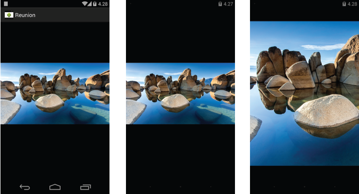

HideyBarPhotoViewScreen
=======================

This library has been created for the need of showing photos like the native pictures gallery does. 

The current behaviour to show pictures in Gallery in Android is saving the picture into the phone and then call an Intent with ACTION_VIEW. After that, the user will be redirected to the Gallery and will be able to see the picture.

Sometimes, we only want to display that picture in full screen and would like to open that picture without leaving our app and all without saving this picture in the device.

The native app of the Android gallery hides the action bar in two cases:

1-The user enters in the photo view screen and after X seconds the actionbar will be hidden.

2-Once hidden, the users taps the photo so the actionbar becomes visible and being able to perform actions using the menu items. Then after the X seconds, the actionbar will be hidden again.

In this library you can set up the time till the actionbar hides.
   
You can load both pictures from resources or fetch a picture from an url using [**Picasso (Square)**](http://square.github.io/picasso/).

The zoom of the pictures is handled by [**PhotoView from Chris Banes**](https://github.com/chrisbanes/PhotoView)


## Usage

-Add library dependency in your build.gradle file:

```groovy
dependencies{
	compile 'com.github.jfragosoperez:hideybarphotoviewscreen:1.0'
}
```

-Register your activity into the manifest setting your theme. Your theme must have windowActionOverlay in true.

**Activity:**
```xml
<activity
	android:name="com.hideybarphotoviewscreen.HideyBarPhotoViewScreen"
        android:label="@string/app_name"
        android:theme="@style/AppTheme_ActionBarOverlay">
</activity>
```

**Theme:**
```xml
<style name="_AppTheme" parent="android:Theme.Holo.Light.DarkActionBar" />

<style name="AppTheme_ActionBarOverlay" parent="@style/_AppTheme">
	<item name="android:windowActionBarOverlay">true</item>
</style>
```

**Sample of request fetching picture from url (custom photo loader setup):**

```java
Intent hideyBarPhotoViewIntent = HideyBarPhotoViewIntent.newConfiguration()
                .setPhotoUrl("https://lh6.googleusercontent.com/-dJgpQyZK89k/UQOBedpoASI/AAAAAAAALuk/kWhI3-xIX1w/w1902-h1070-no/reunion.jpg",
                        new PicassoPhotoLoader().baseSetup()
                                .setPlaceHolderResId(R.drawable.ic_hidey_bar_photo_view_screen_placeholder)
                                .showProgressView(false))
                .timeToStartHideyMode(4000)
                .screenTitle("Reunion")
                .create(this, HideyBarPhotoViewScreen.class);

startActivity(hideyBarPhotoViewIntent);
```

**Sample of request fetching picture from url (default photo loader setup):**

```java
Intent hideyBarPhotoViewIntent = HideyBarPhotoViewIntent.newConfiguration()
                .setPhotoUrl("https://lh6.googleusercontent.com/-Zku6vhdOOMU/UMop6mAjrCI/AAAAAAAAMRw/FLEcVVoZ-BY/w1648-h1098-no/Delicate+Arch.jpg")
                .timeToStartHideyMode(2000)
                .screenTitle("Delicate Arch")
                .create(this, HideyBarPhotoViewScreen.class);
startActivity(hideyBarPhotoViewIntent);
```

**Sample of static picture request:**

````java
Intent hideyBarPhotoViewIntent = HideyBarPhotoViewIntent.newConfiguration()
                .setPhotoResourceId(R.drawable.grand_sunset)
                .timeToStartHideyMode(3000)
                .screenTitle("Grand Sunset")
                .create(this, HideyBarPhotoViewScreen.class);

startActivity(hideyBarPhotoViewIntent);
```

## Screenshots:



## Libraries:

[**Picasso (Square)**](http://square.github.io/picasso/).

[**PhotoView from Chris Banes**](https://github.com/chrisbanes/PhotoView)

## Photography:

Photographs have been captured by Romain Guy.

## NOTE: 

This library needs some unit testing. I'll do in my free time. Pull requests and new features will be always welcome.

## License

    Copyright 2014 Jonathan Fragoso Perez

    Licensed under the Apache License, Version 2.0 (the "License");
    you may not use this file except in compliance with the License.
    You may obtain a copy of the License at

       http://www.apache.org/licenses/LICENSE-2.0

    Unless required by applicable law or agreed to in writing, software
    distributed under the License is distributed on an "AS IS" BASIS,
    WITHOUT WARRANTIES OR CONDITIONS OF ANY KIND, either express or implied.
    See the License for the specific language governing permissions and
    limitations under the License.

  
